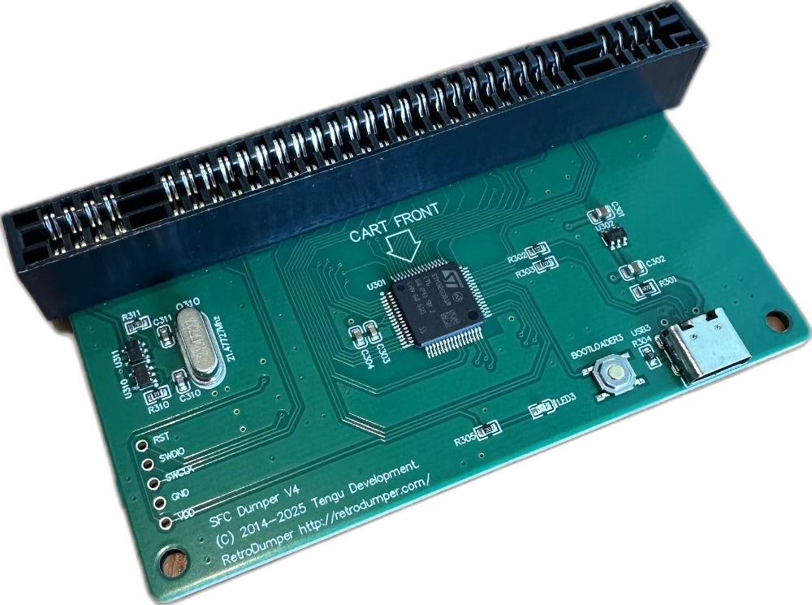

# retrodump

Command-line dumper for the [RetroDumper](https://www.gamebank-web.com/) cartridge readers developed by Tengu Development.

<p align="center">
  
</p>

## Download

Download a build from this repository's Releases page. Unpack it and run `retrodump`. Rust is not required.

A push to `main` publishes the next version when the commits include a feature, a fix, or a breaking change. The release notes are drafted from those commits.

Build from source when you want a local binary instead.

## Usage

Plug in the reader with a cartridge seated, then:

```
retrodump device                  list the attached Retro Dumper
retrodump snes info               read and parse the cartridge header
retrodump snes dump [-o FILE]     dump the ROM
retrodump snes read-save [-o FILE]
retrodump snes write-save FILE
retrodump snes flash FILE         program a flash cart
retrodump debug peek ADDR LEN     hexdump bus addresses via DUMP.ROM
retrodump help
```

`dump` and `read-save` take `--size` and `--mmc`. `write-save` and `flash` take `--mmc`. `dump` checks the ROM checksum, `write-save` checks the save by reading it back, and `flash` checks the chip by reading it back, unless you pass `--no-verify`. `--size`, `--mmc`, and `debug peek` take decimal, `0x` hex, `0b` binary, or a leading `0` for octal.

## Currently supported

- SNES / SFC `info`, `dump`, `read-save`, and `write-save`. Checked on firmware `GEN_PCB02_FW400` version `20260520`.
- SNES / SFC `flash`. Not checked on hardware. Use with caution and report bugs.

## Planned

In this order:

- Master System
- Game Gear
- Mega Drive / Genesis
- PC Engine / TurboGrafx-16
- WonderSwan / WonderSwan Color
- Game Boy / Game Boy Color
- MSX
- Virtual Boy
- Game Boy Advance
- Famicom / NES
- Famicom Disk System
- Nintendo 64
- Nintendo DS / DSi
- Neo Geo Pocket / Neo Geo Pocket Color

A 3DS cartridge is identified and the dump is refused. A 3DS dump is not planned.

## Limitations

- Flash save chips are not written. `write-save` writes SRAM only.
- Firmware update is not implemented.
- Cart identification uses the client's cart table. A cart that is not in that table needs `--mmc` and `--size`.

## Build from source

### Requirements

- Rust 1.99 or newer. [rustup](https://rustup.rs/) is the straightforward install. Older distro packages of Rust will not build this crate.
- A system linker, which `rustc` calls:
  - macOS: Xcode Command Line Tools (`xcode-select --install`).
  - Linux: a C toolchain. On Debian and Ubuntu that is `build-essential`. On Fedora that is `gcc`.
- No libusb and no extra USB library. The reader is a normal USB drive.

Cargo downloads `crc`, `getrandom`, and, on Unix, `libc`.

### Linux and macOS

```sh
cargo build --release
```

The binary is `target/release/retrodump`.

```sh
cargo test                    # offline; no device and no ROM files
cargo clippy --all-targets
```

## Layout

```
src/main.rs            CLI
src/lib.rs             crate root (Error, re-exports)
src/protocol.rs        512-byte frames, CRC-16/XMODEM
src/device/mod.rs      discovery, T-DRIVER info, transport retry/backoff, Bus
src/device/sys/        per-OS MSC I/O (unix: std + libc, windows: CreateFileW)
src/cart.rs            DumpMap, Program, shared dump and flash loops
src/snes/              header, cart table, mappers, SRAM, checksum, flash, group, opcodes
```
